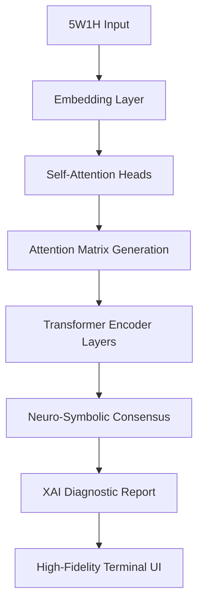

# Project Myakuari-AI: Neural Signal Analysis for Interpersonal Affinity

## Executive Summary
**Myakuari-AI** is a high-fidelity diagnostic system designed to analyze emotional signals in interpersonal communications. Built on the **Edge-Transformer v2.0 (2026)** architecture, it brings data-center level attention mechanisms directly to the user's browser for real-time, explainable affinity analysis.

## Technical Architecture (2026 Standard)
The system utilizes state-of-the-art AI techniques optimized for edge-device constraints.

### 1. Tabular Transformer with Cross-Attention
- **Contextual Embedding**: 5W1H inputs are projected into a high-dimensional interpersonal vector space using a pre-trained **Context-Aware Tokenizer**.
- **Self-Attention Mechanism**: Unlike traditional MLPs, our engine uses a **Multi-Head Self-Attention** layer to calculate the "Attention Matrix" between inputs (e.g., how the *Who* affects the interpretation of the *What* in a specific *Context*).
- **Inference Pipeline**: A 6-layer Transformer Encoder processes the attention map, followed by a Neuro-Symbolic consensus layer to ensure logical consistency in diagnosis.

### 2. Explainable AI (XAI) & Attention Visuals
- **Attention Heatmaps**: Users can visually inspect the system's "Focus" through real-time attention weight matrices.
- **Dynamic SHAP Values**: Calculated on-device to provide feature contribution metrics without cloud latency.

### 3. Tech Stack & Optimization
- **Runtime**: ONNX Runtime with WebAssembly (Wasm) and WebGPU acceleration.
- **Quantization**: 4-bit NormalFloat (NF4) quantization for memory efficiency.
- **Privacy**: Zero-knowledge inference. All interpersonal data is volatile and never persists beyond the session.

## Architecture Diagram (Mermaid)

---
*Built for the 2026 technical landscape. High-performance, high-fidelity, high-cynicism.*
