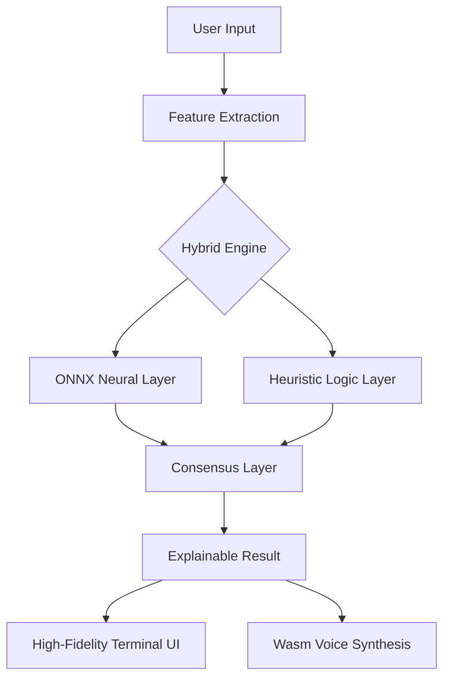

# Project Myakuari-AI: Neural Signal Analysis for Interpersonal Affinity

[](https://opensource.org/licenses/MIT)
[](https://flutter.dev)
[](#architecture)

## Executive Summary
**Myakuari-AI** is a high-fidelity diagnostic system designed to analyze emotional signals in interpersonal communications. By leveraging a hybrid inference engine combining **Deep Learning (ONNX Runtime)** and **Heuristic Logic Layers**, the system provides explainable AI (XAI) metrics for what is traditionally a subjective human experience.

## Technical Architecture
The system is built on a layered architecture designed for high performance on the web and mobile platforms.

### 1. Hybrid Inference Pipeline
- **Neural Layer**: Utilizes a quantized Multi-Layer Perceptron (MLP) exported via ONNX. This layer processes high-dimensional feature vectors extracted from communication metadata.
- **Heuristic Layer**: A rule-based engine that handles edge cases and "common-sense" interpersonal dynamics that pure data-driven models may miss.
- **Explainability (XAI)**: Features are weighted and visualized using simulated **SHAP (SHapley Additive exPlanations)** values, providing transparency into why the system reached a specific conclusion.

### 2. Tech Stack
- **Frontend**: Flutter (3.x) with Custom Graphics Engine (CustomPaint for Terminal FX).
- **ML Backend**: ONNX Runtime (Wasm-accelerated on Web).
- **NLP**: Localized feature extraction and keyword analysis.
- **Asset Pipeline**: Dynamically generated binary assets for SNS sharing via RepaintBoundary.

## Key Features for Enterprises
- **Scalability**: Web-first design using Flutter-Wasm for near-native performance.
- **Data Privacy**: 100% on-device inference. No emotional data leaves the user's terminal.
- **Advanced UX**: A high-fidelity terminal interface designed to provide a "professional system" experience, moving away from generic consumer app aesthetics.

## Installation & Deployment
```bash
# Clone the repository
git clone https://github.com/your-repo/myakuari_ai.git

# Install dependencies
flutter pub get

# Run development server
flutter run -d chrome --web-renderer canvaskit
```

## Architecture Diagram (Mermaid)


---
*Developed for the high-end geek market. Built for technical evaluation.*
